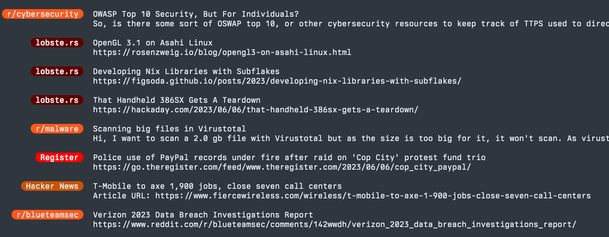

# happen

A hacked together terminal-based feed reader, created for my own use. Designed to tick away in a window and surface recent items of interest in a chat-like view.

Configure desired feeds in the config file at `~/.config/happen.yaml` (will be created with default settings after running once.)



## Key Bindings

| Key                     | Description |
| ----------------------- | ----------- |
| `up`/`k`                | Move selection up |
| `down`/`j`              | Move selection down |
| `pageup`                | Page selection up |
| `pagedown`              | Page selection down |
| `home`/`g`/`0`          | Move up to oldest item  |
| `end`/`G`/`$`           | Move down to newest item  |
| `esc`                   | Clear selection |
| `enter`                 | Open selected item in default browser |
| `i`                     | Open image for selected item (if it has one) |
| `/`                     | Filter/search items. Use `enter` to confirm and escape to `cancel/clear` |
| `r`                     | Refresh feeds |
| `q`                     | Exit |

## Config File

```yaml
showDescriptions: true # show a description/content preview under each item
showHelp: true # show the help strip at the bottom of the window, showing shortcuts + time to next update
maxBadgeSize: 16 # max length of badge names
pollInterval: 1m # how often to poll - can use h/m/s
subreddits: # list of subreddits to add to the feed
  - blueteamsec
  - cloudsecurity
  - blackhat
  - cyber
  - cybersecurity
  - exploitdev
  - malware
  - redteamsec
  - pwned
sources: # list of generic feed sources - all parameters are optional except url
    - name: BBC
      url: https://feeds.bbci.co.uk/news/world/rss.xml
      bg: '#930000' # badge background colour
      fg: '#e4e6e9' # badge foreground colour
      maxAge: 4h # oldest items to display from the feed
    - name: Hacker News
      url: https://hnrss.org/newest?points=20
      bg: '#cc5200'
      fg: '#e4e6e9'
      maxAge: 8h
    - name: lobste.rs
      url: https://lobste.rs/rss
      bg: '#5e0000'
      fg: '#ffffff'
      maxAge: 24h
```
